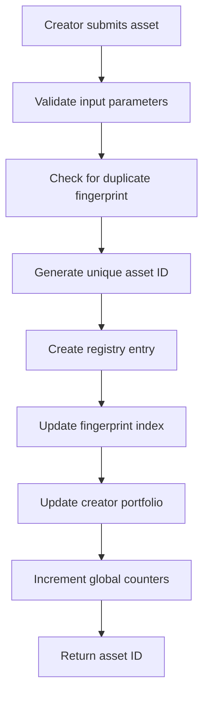
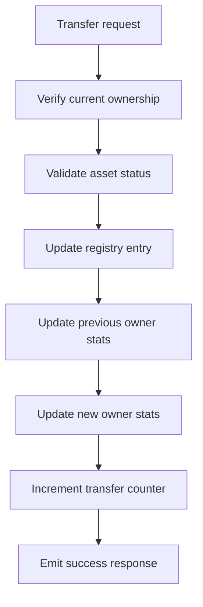

# BitVault: Decentralized Digital Asset Registry

[](https://stacks.co)
[](https://clarity-lang.org)
[](LICENSE)
[](https://vitest.dev)

A revolutionary content ownership protocol built on the Stacks blockchain, leveraging Bitcoin's security to create an immutable registry of digital assets. BitVault enables creators to establish verifiable ownership of their digital content through cryptographic proof, fostering a trustless ecosystem for intellectual property management.

## 🌟 Key Features

- **Bitcoin-Anchored Security**: Immutable ownership records anchored to Bitcoin's blockchain
- **Content Authenticity**: Cryptographic hash-based content verification system
- **Seamless Transfers**: Automated ownership transfers with complete provenance tracking
- **Gas-Efficient Operations**: Optimized batch operations for content creators
- **Comprehensive Analytics**: Built-in protocol metrics and creator portfolio tracking
- **Duplicate Prevention**: SHA-256 fingerprinting prevents duplicate content registration

## 🏗️ System Overview

BitVault operates as a decentralized registry where digital assets are represented by unique identifiers and cryptographic fingerprints. The protocol maintains three core data relationships:

1. **Asset Registry**: Maps asset IDs to comprehensive metadata including ownership, content details, and registration history
2. **Fingerprint Index**: Enables O(1) content lookup and prevents duplicate registrations
3. **Creator Portfolios**: Tracks ownership statistics and registration history for each creator

### Security Model

- **Ownership Verification**: Only asset owners can transfer or modify their assets
- **Content Integrity**: SHA-256 fingerprints ensure content authenticity
- **Immutable History**: All operations are permanently recorded on the blockchain
- **Soft Deletion**: Assets can be archived while preserving historical provenance

## 📋 Contract Architecture

### Core Data Structures

```clarity
;; Primary asset registry
(define-map digital-asset-registry
  { asset-id: uint }
  {
    owner: principal,
    asset-title: (string-ascii 256),
    asset-description: (string-ascii 1024),
    content-fingerprint: (buff 32),
    media-type: (string-ascii 64),
    registration-block: uint,
    last-modified-block: uint,
    status: bool,
  }
)

;; Content fingerprint to asset ID mapping
(define-map fingerprint-to-asset
  { content-fingerprint: (buff 32) }
  { asset-id: uint }
)

;; Creator portfolio tracking
(define-map creator-portfolio
  { creator: principal }
  {
    total-assets: uint,
    first-registration-block: uint,
  }
)
```

### State Variables

- `global-asset-counter`: Tracks the next available asset ID
- `total-registered-assets`: Global count of registered assets
- `total-ownership-transfers`: Protocol-wide transfer statistics

## 🔄 Data Flow

### Asset Registration Flow



### Ownership Transfer Flow



## 🛠️ Installation & Setup

### Prerequisites

- [Clarinet](https://github.com/hirosystems/clarinet) v2.0+
- [Node.js](https://nodejs.org/) v18+
- [Git](https://git-scm.com/)

### Quick Start

1. **Clone the repository**

   ```bash
   git clone https://github.com/williams-adamu/bitvault.git
   cd bitvault
   ```

2. **Install dependencies**

   ```bash
   npm install
   ```

3. **Run tests**

   ```bash
   npm test
   ```

4. **Check contracts**

   ```bash
   clarinet check
   ```

5. **Start development console**

   ```bash
   clarinet console
   ```

## 📖 Usage Guide

### Registering a Digital Asset

```clarity
(contract-call? .bitvault register-digital-asset
  "My Digital Artwork"                    ;; asset-title
  "A unique piece of digital art"         ;; asset-description
  0x1234567890abcdef...                   ;; content-fingerprint (SHA-256)
  "image/png"                             ;; media-type
)
```

### Transferring Ownership

```clarity
(contract-call? .bitvault transfer-asset-ownership
  u1                                      ;; asset-id
  'SP1234567890ABCDEF                     ;; new-owner
)
```

### Updating Asset Metadata

```clarity
(contract-call? .bitvault update-asset-metadata
  u1                                      ;; asset-id
  "Updated Title"                         ;; new-title
  "Updated description"                   ;; new-description
)
```

### Querying Asset Information

```clarity
;; Get asset details
(contract-call? .bitvault fetch-asset-details u1)

;; Find asset by content fingerprint
(contract-call? .bitvault find-asset-by-fingerprint 0x1234...)

;; Check ownership
(contract-call? .bitvault validate-asset-ownership u1 'SP1234...)

;; Get creator statistics
(contract-call? .bitvault get-creator-asset-count 'SP1234...)
```

## 📊 Protocol Analytics

BitVault provides comprehensive analytics for protocol monitoring:

### Global Metrics

```clarity
(contract-call? .bitvault get-protocol-metrics)
;; Returns: { total-assets-registered, total-ownership-transfers, next-asset-id }
```

### Creator Profiles

```clarity
(contract-call? .bitvault get-creator-profile 'SP1234...)
;; Returns: { total-assets, first-registration-block }
```

## 🧪 Testing

The project uses Vitest with Clarinet SDK for comprehensive testing:

```bash
# Run all tests
npm test

# Run tests with coverage
npm run test:report

# Watch mode for development
npm run test:watch
```

### Test Coverage

- ✅ Asset registration validation
- ✅ Ownership transfer mechanics
- ✅ Metadata update functionality
- ✅ Asset archival operations
- ✅ Query interface verification
- ✅ Error handling scenarios
- ✅ Protocol analytics accuracy

## 🔐 Security Considerations

### Input Validation

- Asset IDs are bounded (1 to 999,999,999)
- String lengths are enforced (titles: 1-256 chars, descriptions: 0-1024 chars)
- Content fingerprints must be non-empty
- Media types must be specified

### Access Control

- Only asset owners can transfer or modify their assets
- The protocol admin is set at deployment time
- All operations require valid authorization

### Data Integrity

- Content fingerprints prevent duplicate registrations
- Immutable registration timestamps provide audit trails
- Soft deletion preserves historical provenance

## 📝 Error Codes

| Code | Constant | Description |
|------|----------|-------------|
| 1001 | `ERR_UNAUTHORIZED_ACCESS` | Caller lacks required permissions |
| 1002 | `ERR_ASSET_NOT_FOUND` | Asset ID does not exist |
| 1003 | `ERR_DUPLICATE_ASSET_HASH` | Content fingerprint already registered |
| 1004 | `ERR_INVALID_PARAMETERS` | Input validation failed |
| 1005 | `ERR_OWNERSHIP_TRANSFER_FAILED` | Transfer operation failed |
| 1006 | `ERR_ASSET_DEACTIVATED` | Operation on archived asset |
| 1007 | `ERR_INVALID_ASSET_ID` | Asset ID out of valid range |
| 1008 | `ERR_INVALID_STRING_LENGTH` | String length validation failed |

## 🚀 Deployment

### Testnet Deployment

1. Configure your Clarinet.toml for testnet
2. Deploy using Clarinet:

   ```bash
   clarinet deployments apply --network testnet
   ```

### Mainnet Deployment

1. Ensure comprehensive testing is complete
2. Configure mainnet settings in `settings/Mainnet.toml`
3. Deploy with production parameters:

   ```bash
   clarinet deployments apply --network mainnet
   ```

## 🤝 Contributing

We welcome contributions to BitVault! Please see our [Contributing Guidelines](CONTRIBUTING.md) for details.

### Development Workflow

1. Fork the repository
2. Create a feature branch
3. Write tests for new functionality
4. Ensure all tests pass
5. Submit a pull request

## 📄 License

This project is licensed under the MIT License - see the [LICENSE](LICENSE) file for details.

## 🔗 Links

- [Stacks Documentation](https://docs.stacks.co/)
- [Clarity Language Reference](https://docs.stacks.co/clarity/)
- [Clarinet Documentation](https://docs.hiro.so/clarinet/)
